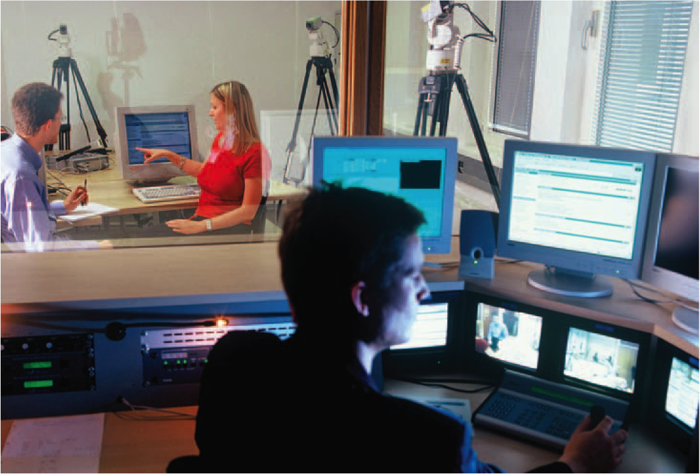
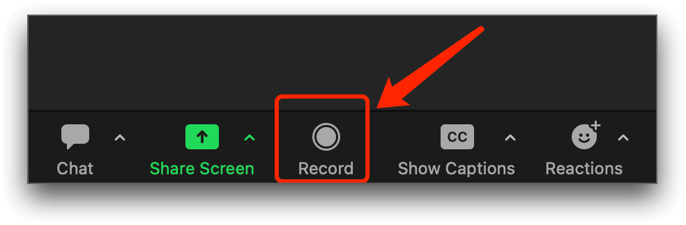

# Final Prototype and User Interactions
## Ian Sanchez Baca 5/11/23

[Final Prototype Link](https://xd.adobe.com/view/28bba141-bb3d-495b-b7c5-80384af23a86-7de8/?fullscreen)

This week, my partner and I carried out a series of "User Test Procedures," involving the administration of printed protocols and informed consent forms for each of the five sessions. In order to record the participants' voices and interactions with our prototype, we utilized the video conferencing software, "Zoom." The finalized prototype is accessible via the hyperlink located at the top of this page. Please note, due to privacy restrictions outlined in the consent form, we regret that we are unable to share any signed documentation containing user information or recorded video material, as all such materials are slated for deletion at the end of the academic term.

The User Test Procedures identified several issues with the prototype, including difficulty in navigating the user interface, unclear call-to-action buttons, and confusing labeling of certain features. 
Additionally, the study revealed that some of the tasks were too complex and required further simplification. Overall, the participants found the prototype to be promising and expressed a willingness to use it again once the issues identified were resolved.

Now there are many different ways to record our participants. We could have gone the way shown in the image below.

While the aforementioned method may be deemed efficient, it is, in our opinion, overly elaborate. In lieu of this approach, we employed a simpler technique that involved recording user interactions with our prototype via Zoom. 

*We regret to inform that the recordings are not available for viewing, as per our commitment to destroy them at the conclusion of the semester.* 
Zoom proved to be an effective tool for capturing all user interactions and recording the participants' voices. 
Additionally, the platform facilitated the recording of any other digital assets, including screen shares and the use of chat features. 
By using Zoom to record the sessions, we were able to capture every aspect of the user interaction, including the participant's thought processes, impressions, and comments on the prototype. 
The recordings captured the nuances of user experience, providing us with comprehensive feedback on the prototype's design and usability.
This data collection process is immensely valuable for individuals involved in prototyping, as it enables the collection of user feedback that identifies areas where the prototype may require improvement. 
Such feedback is vital, as it highlights any aspects of the prototype that may not be readily comprehensible to the user.

The use of Zoom as a data collection tool was effective, enabling us to capture comprehensive user feedback accurately. By refining the prototype based on the insights gleaned from the study, we hope to create a user experience that is both intuitive and seamless. We believe that the User Test Procedures will be invaluable to future UX designers, providing them with the tools and knowledge necessary to create prototypes that meet the needs of their users.
